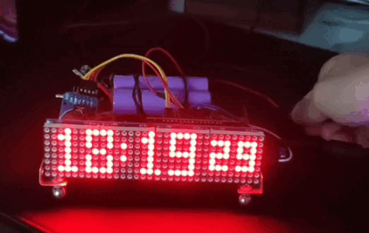

# NodeMCU v1.0 clock

A simple and usefull RTC based on ESP12e SoC.

# How it works?
- The time is picked from a NTP server and stored in the DS3231 RTC chip then it's displayed on the MAX7219 led matrix display.
- By pressing the pushbutton you can change from time screen to the date screen or the temperature screen.

# What do you need?

1. NodeMCU v1.0 (also called ESP8266 v2.0 or even 3.0)
2. A DS3231 RTC and a LIR2032 battery (if you want to use a CR2032 battery remove the 200Ω resistor)
3. A MAX7219 controlled matrix display (the one I used has 4 devices)
4. A pushbutton to change the current screen
5. A power supply

# Connections

### For the DS3231 the connections are:
  
| DS3231 | NodeMCU |
| ----------- | ----------- |
| VCC | 3.3V |
| GND | GND |
| SCL | D1 |
| SDA | D2 |

### For the MAX7219 the connections are:

| MAX7219 | NodeMCU |
| ----------- | ----------- |
| VCC | 3.3V |
| GND | GND |
| CLK | D5 |
| DIN | D7 |
| CS | D8 |

### For pushbutton:

| PB | NodeMCU |
| ----------- | ----------- |
|  + | D6 |
|  - | GND |
    
### For the power supply:

| PS | NodeMCU |
| ----------- | ----------- |
| +5V | VIN |
| -5V | GND |

# Requirements

- Platform.io (or the VScode extension)
- Python3

# Setting up

Before building the firmware and upload it you need to:
- in `config` directory change the `config.h.dist` file name in `config.h` 
- in the file `config.h` change the `SSID` and the `PASSWORD` variables with your network ones
- in the file `config.h` change the `NTPserver` variable with the ones you prefer, choose one from `data/ntpservers.h` or add a new one in it
- in the file `config.h` change the `MyTMZ` variable with the correct timezone of your country, choose one from `data/timezones.h` or add a new one in it
  
You can also change the MAX7219 pins if needed, the number of matrix devices and the pushbutton pin.

# Credits

[Leonardo Mirabella](https://github.com/infra-blue)
